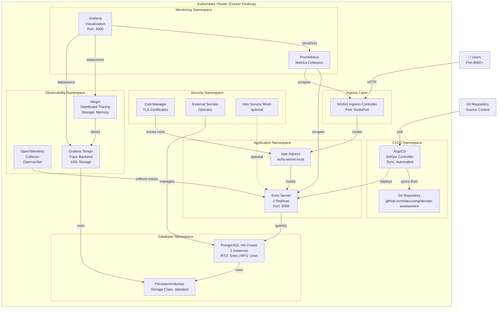
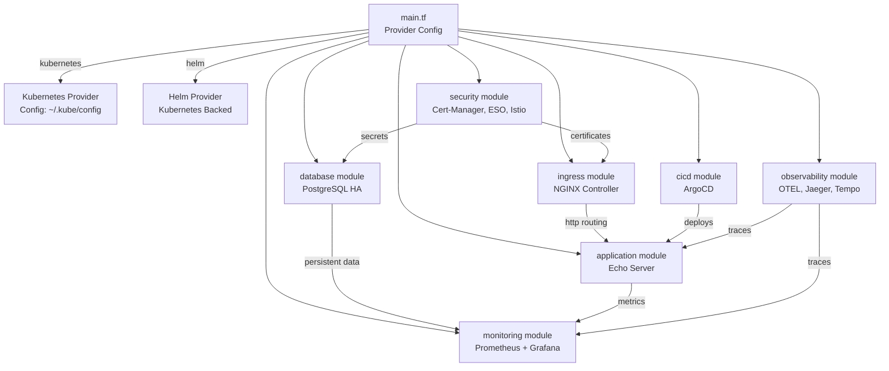
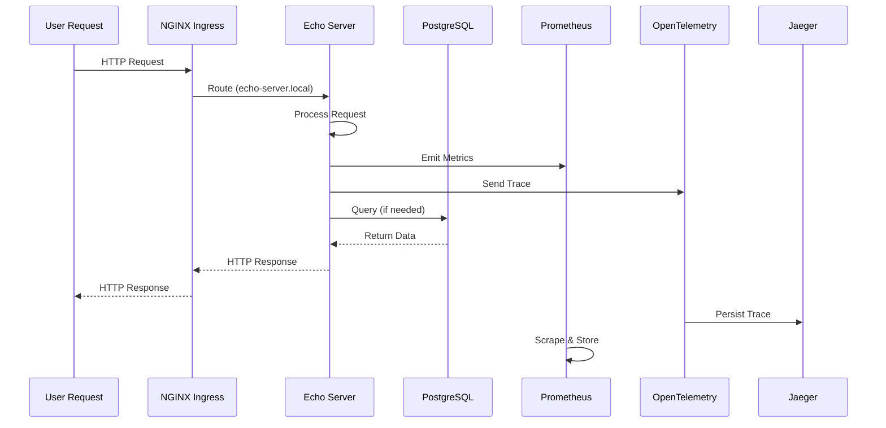
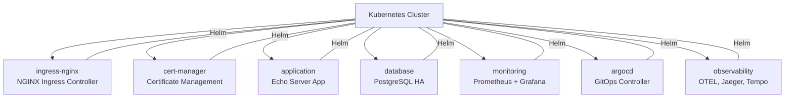
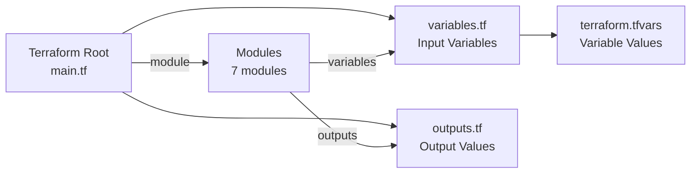

# Kubernetes Infrastructure Architecture

## System Overview

This Terraform configuration deploys a comprehensive Kubernetes platform on Docker Desktop with the following components:

### Core Components

1. **Ingress Layer** - NGINX Ingress Controller
2. **Application** - Echo Server microservice
3. **Database** - PostgreSQL HA cluster
4. **Monitoring** - Prometheus + Grafana
5. **Security** - Cert-Manager, External Secrets, Istio
6. **CI/CD** - ArgoCD for GitOps
7. **Observability** - OpenTelemetry Collector, Jaeger, Grafana Tempo

## Architecture Diagram

## Module Dependencies

## Data Flow Diagram

## Namespace Organization

## Configuration Hierarchy

## Resource Summary

| Component | Type | Count | Namespace | Purpose |
|-----------|------|-------|-----------|---------|
| NGINX Ingress | Helm Chart | 1 | ingress-nginx | HTTP(S) routing |
| Echo Server | Helm Chart | 1 | application | Demo application (2 replicas) |
| PostgreSQL | Helm Chart | 1 | database | HA cluster (3 instances) |
| Prometheus | Helm Chart | 1 | monitoring | Metrics collection |
| Grafana | Helm Chart | 1 | monitoring | Visualization & dashboards |
| Cert-Manager | Helm Chart | 1 (optional) | cert-manager | TLS certificate issuing |
| External Secrets | Helm Chart | 1 (optional) | external-secrets | Secret management |
| Istio | Helm Chart | 1 (optional) | istio-system | Service mesh |
| ArgoCD | Helm Chart | 1 | argocd | GitOps continuous deployment |
| OpenTelemetry | Helm Chart | 1 | observability | Trace/metric collection |
| Jaeger | Helm Chart | 1 | observability | Distributed tracing |
| Grafana Tempo | Helm Chart | 1 | observability | Trace backend |

## Key Features

### High Availability
- PostgreSQL HA cluster with 3 instances
- RTO: 5 minutes, RPO: 1 minute
- Persistent volume storage

### Security
- Cert-Manager for automatic TLS certificates
- External Secrets Operator for credential management
- Optional Istio service mesh for advanced traffic management

### Observability
- Prometheus for metrics collection
- Grafana for visualization
- OpenTelemetry Collector for distributed tracing
- Jaeger for trace visualization
- Grafana Tempo for trace backend (10Gi storage)

### GitOps
- ArgoCD for declarative application deployment
- Automated sync policy
- Auto-prune and self-healing enabled
- Git repository as source of truth

### Resource Management
- CPU/Memory requests and limits configured
- NGINX: 100m request / 500m limit
- Echo Server: 100m request / 500m limit
- OTel Collector: 100m request / 500m limit
