# Infrastructure Architecture Diagram

## Complete System Architecture

```mermaid
graph TB
    subgraph User["External Access"]
        HTTP["HTTP/HTTPS Requests"]
    end
    
    subgraph K8s["Kubernetes Cluster<br/>(Docker Desktop)"]
        
        subgraph IngressNS["🔓 Ingress Namespace<br/>(ingress-nginx)"]
            NGINX["NGINX Ingress Controller<br/>Service: NodePort"]
        end
        
        subgraph SecurityNS["🔐 Security Namespace"]
            CERT["Cert-Manager<br/>TLS Certificates"]
            EXTSC["External Secrets<br/>Secret Management"]
            ISTIO["Istio<br/>Service Mesh<br/>(optional)"]
        end
        
        subgraph AppNS["📦 Application Namespace<br/>(application)"]
            INGRESSAPP["Ingress<br/>echo-server.local"]
            APP1["Echo Server Pod 1<br/>Port 3000"]
            APP2["Echo Server Pod 2<br/>Port 3000"]
            APPSVC["Service ClusterIP<br/>Port 3000"]
        end
        
        subgraph DBNS["🗄️ Database Namespace<br/>(database)"]
            PG1["PostgreSQL Pod 1<br/>Primary"]
            PG2["PostgreSQL Pod 2<br/>Replica"]
            PG3["PostgreSQL Pod 3<br/>Replica"]
            DBSVC["Service FQDN<br/>postgres.database"]
            PV["PersistentVolumes<br/>Standard Storage"]
        end
        
        subgraph MonNS["📊 Monitoring Namespace<br/>(monitoring)"]
            PROM["Prometheus<br/>Metrics Scraper<br/>Port 9090"]
            GRAF["Grafana<br/>Visualization<br/>Port 3000"]
            GRAFDB["Grafana DB<br/>Datasources"]
        end
        
        subgraph ObsNS["🔍 Observability Namespace<br/>(observability)"]
            OTEL["OpenTelemetry<br/>Collector DaemonSet<br/>Ports: 4317/4318"]
            JAG["Jaeger<br/>Trace Storage<br/>Port: 16686"]
            TEMPO["Grafana Tempo<br/>Trace Backend<br/>10Gi Storage"]
        end
        
        subgraph CINSub["🚀 CI/CD Namespace<br/>(argocd)"]
            ARGO["ArgoCD Controller<br/>GitOps Manager<br/>Port: 8080"]
            ARGOSVC["ArgoCD Service<br/>Type: ClusterIP"]
        end
        
        %% Internal routing
        HTTP -->|Port 80/443| NGINX
        
        NGINX -->|Route| INGRESSAPP
        INGRESSAPP -->|Route| APPSVC
        APPSVC -->|Load Balance| APP1
        APPSVC -->|Load Balance| APP2
        
        APP1 -->|Connect| DBSVC
        APP2 -->|Connect| DBSVC
        
        DBSVC -->|Route| PG1
        DBSVC -->|Route| PG2
        DBSVC -->|Route| PG3
        
        PG1 -->|Persist| PV
        PG2 -->|Persist| PV
        PG3 -->|Persist| PV
        
        PROM -->|Scrape| APP1
        PROM -->|Scrape| APP2
        PROM -->|Scrape| NGINX
        PROM -->|Scrape| OTEL
        
        GRAF -->|Query| PROM
        GRAF -->|Query| JAG
        GRAF -->|Query| TEMPO
        
        OTEL -->|Collect Traces| APP1
        OTEL -->|Collect Traces| APP2
        OTEL -->|Send| JAG
        OTEL -->|Send| TEMPO
        
        JAG -->|Forward| TEMPO
        
        CERT -->|Issue Certs| INGRESSAPP
        EXTSC -->|Manage Secrets| PG1
        ISTIO -.->|Optional|APP1
        ISTIO -.->|Optional|APP2
        
        ARGO -->|Deploy from Git| APP1
        ARGO -->|Deploy from Git| APP2
        ARGO -->|Sync Policy| ARGOSVC
    end
    
    subgraph External["External Services"]
        GIT["Git Repository<br/>github.com/daucuong<br/>devops-assessment"]
    end
    
    ARGO -->|Pull Manifests| GIT
    GIT -->|Webhooks| ARGO
```

## Detailed Component Breakdown

## Data Flow: Request to Response

## Storage & Persistence Architecture

## Resource Requirements Summary

## Module Dependency Graph

## High Availability & Disaster Recovery

## Security Architecture

## Observability Stack Integration

